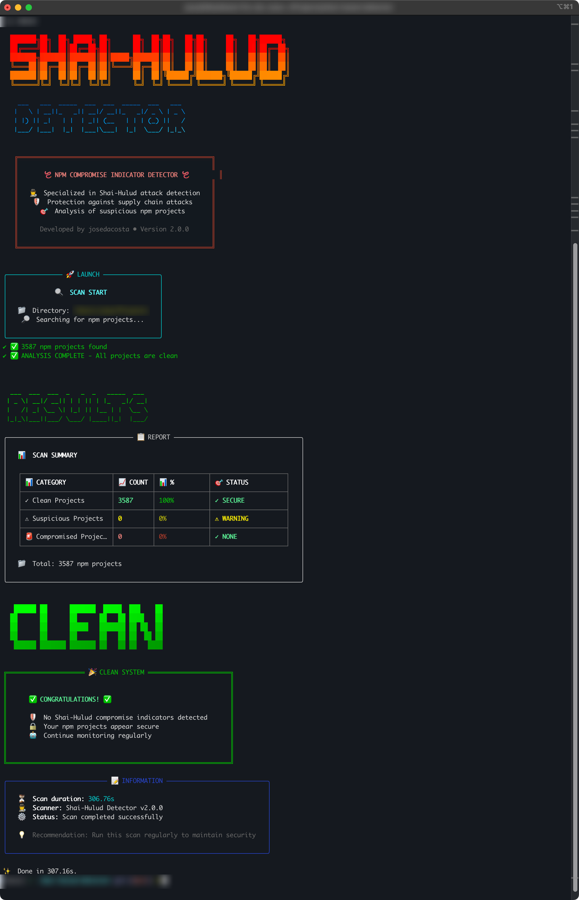
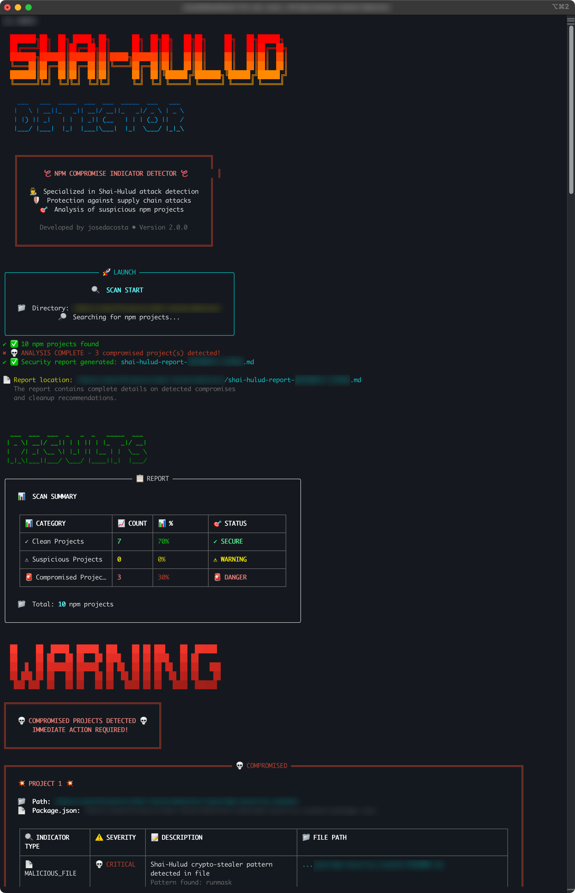

```
   ███████╗██╗  ██╗ █████╗ ██╗      ██╗  ██╗██╗   ██╗██╗     ██╗   ██╗██████╗ 
   ██╔════╝██║  ██║██╔══██╗██║      ██║  ██║██║   ██║██║     ██║   ██║██╔══██╗
   ███████╗███████║███████║██║█████╗███████║██║   ██║██║     ██║   ██║██║  ██║
   ╚════██║██╔══██║██╔══██║██║╚════╝██╔══██║██║   ██║██║     ██║   ██║██║  ██║
   ███████║██║  ██║██║  ██║██║      ██║  ██║╚██████╔╝███████╗╚██████╔╝██████╔╝
   ╚══════╝╚═╝  ╚═╝╚═╝  ╚═╝╚═╝      ╚═╝  ╚═╝ ╚═════╝ ╚══════╝ ╚═════╝ ╚═════╝ 
                                                                                
                      ██████╗ ███████╗████████╗███████╗ ██████╗████████╗ ██████╗ ██████╗ 
                      ██╔══██╗██╔════╝╚══██╔══╝██╔════╝██╔════╝╚══██╔══╝██╔═══██╗██╔══██╗
                      ██║  ██║█████╗     ██║   █████╗  ██║        ██║   ██║   ██║██████╔╝
                      ██║  ██║██╔══╝     ██║   ██╔══╝  ██║        ██║   ██║   ██║██╔══██╗
                      ██████╔╝███████╗   ██║   ███████╗╚██████╗   ██║   ╚██████╔╝██║  ██║
                      ╚═════╝ ╚══════╝   ╚═╝   ╚══════╝ ╚═════╝   ╚═╝    ╚═════╝ ╚═╝  ╚═╝
```

[](https://opensource.org/licenses/MIT)
[](https://nodejs.org)
[](https://www.typescriptlang.org/)
[](https://en.wikipedia.org/wiki/Command-line_interface)
[](https://en.wikipedia.org/wiki/Security_scanner)
[](https://en.wikipedia.org/wiki/Computer_security)
[](https://www.npmjs.com/)
[](https://en.wikipedia.org/wiki/Malware)
[](https://nodejs.org/en/docs/meta/topics/dependencies/)
[](https://yarnpkg.com/)
[](https://makeapullrequest.com)

<table border="0" style="border: none; background: transparent;">
  <tr style="border: none; background: transparent;">
    <td style="border: none; background: transparent; text-align: center;">
      
    </td>
    <td style="border: none; background: transparent; text-align: center;">
      
    </td>
  </tr>
</table>

A detection tool for compromise indicators of the Shai-Hulud attack in npm projects.

## 📖 Description

Following major attacks on the npm ecosystem in 2025, notably the sophisticated "Shai-Hulud" attack, this tool allows you to scan your system for
potentially compromised npm projects.

The detector analyzes:

- Suspicious `package.json` files
- Malicious npm scripts
- Files with known malicious hashes
- Injected GitHub Actions workflows
- Crypto-stealer patterns
- Shai-Hulud specific indicators

## 📚 References

> [!CAUTION]
> **For more information about the Shai-Hulud attack**
>
> Check the [NEWS.md](NEWS.md) file which contains a complete and detailed analysis of the Shai-Hulud attack, including the timeline of
> events, technical analysis and compromise indicators.

Based on analysis of documented attacks in:

- The Shai-Hulud attack of September 2025
- Compromises of popular packages (debug, chalk, etc.)
- GitHub Actions workflow injection techniques
- Crypto-stealer patterns identified by the security community

## 📦 Installation

```bash
# Install dependencies
yarn install

# Compile TypeScript
yarn build

# Make the script executable
chmod +x dist/index.js
```

## 🚀 Usage

### Interactive mode (default)

```bash
yarn start
```

### Command line mode

```bash
# Scan the root directory
yarn start -d /

# Scan a specific directory
yarn start -d /path/to/projects

# Exclude specific directories from scan
yarn start -d /path/to/projects -e "my-project,backup,temp"

# Verbose mode
yarn start -d /home/user/projects -v

# JSON output
yarn start -d /home/user/projects --json

# Non-interactive mode
yarn start -d /home/user/projects --no-interactive
```

### Via executable

```bash
# After compilation
./dist/index.js -d /path/to/scan
```

## ⚙️ Options

- `-d, --directory <path>` : Directory to scan (default: `/`)
- `-e, --exclude <dirs>` : Directories to exclude from scan (comma-separated: dir1,dir2,dir3)
- `-v, --verbose` : Verbose mode with additional details
- `-j, --json` : JSON output format
- `--no-interactive` : Disable interactive mode

## 🔍 Detected indicators

### Malicious files

- `bundle.js` files larger than 3MB with known SHA-256 hash
- Files containing "shai-hulud" in the name
- Malicious `node-gyp.dll`
- `shai-hulud-workflow.yml`

### Suspicious scripts

- npm scripts with crypto-stealer patterns
- Suspicious global variables (`stealthProxyControl`, `runmask`, `checkethereumw`)
- TruffleHog references
- Attacker's Ethereum address: `0xFc4a4858bafef54D1b1d7697bfb5c52F4c166976`

### GitHub workflows

- Injected malicious workflows
- References to `webhook.site`
- Unauthorized TruffleHog usage

## 📊 Severity levels

- **CRITICAL** : Confirmed compromise (Shai-Hulud patterns detected)
- **HIGH** : Very suspicious (malicious files, dangerous scripts)
- **MEDIUM** : Suspicious (doubtful dependencies, exposed environment variables)
- **LOW** : Informational

## 📈 Project statuses

- **CLEAN** : No indicators detected
- **SUSPICIOUS** : Low/medium severity indicators
- **COMPROMISED** : Critical indicators or multiple high-level indicators

## 🛠️ Development

```bash
# Development mode with TypeScript
yarn dev

# Linting
yarn lint

# Type checking
yarn typecheck

# Tests
yarn test
```

## 🔒 Security

This tool is designed for defensive detection only. It helps identify potentially compromised projects without exposing sensitive information.

## ⚠️ Disclaimer

**IMPORTANT: READ-ONLY TOOL**

This detection tool operates in **READ-ONLY MODE ONLY**. It **NEVER** modifies, deletes, or creates any files in the scanned directories. The tool
only reads and analyzes existing files to detect compromise indicators.

### What the tool does:

- ✅ Reads and analyzes files (package.json, scripts, etc.)
- ✅ Scans directory contents for malware indicators
- ✅ Generates security reports
- ✅ Provides threat assessment and recommendations

### What the tool NEVER does:

- ❌ Modify existing files
- ❌ Delete any files or directories
- ❌ Create new files in scanned locations
- ❌ Execute or run any found scripts
- ❌ Make any changes to your system

**LIMITATION OF LIABILITY**

We are not responsible for any deterioration or damage to any files or systems that may occur during the execution of this tool. While we have made
our best efforts to ensure the tool operates safely in read-only mode, you remain fully responsible for its execution and any consequences thereof.

**By using this tool, you acknowledge that:**

- It is designed for analysis purposes only and will not alter your files or system in any way
- You use this tool at your own risk and responsibility
- We disclaim any liability for direct or indirect damages that may result from the use of this software

## 🤝 Contributing

Contributions are welcome! Feel free to open an issue or pull request on [GitHub](https://github.com/josedacosta/shai-hulud-detector).

## 📋 Issues and Support

To report a problem or request a feature, visit: [GitHub Issues](https://github.com/josedacosta/shai-hulud-detector/issues)

## 📜 License

MIT - See the [LICENSE](https://github.com/josedacosta/shai-hulud-detector/blob/main/LICENSE) file for more details.


---

## 🏷️ Keywords

<details>
<summary><b>🔍 SEO Keywords</b> (click to expand)</summary>

**Shai-Hulud Attack & Detection:**
`shai-hulud attack` • `shai-hulud detector` • `shai-hulud malware` • `shai-hulud npm attack` • `shai-hulud scanner` • `detect shai-hulud` •
`shai-hulud compromise` • `shai-hulud indicators` • `shai-hulud security tool` • `shai-hulud analysis`

**Security Scanning & Analysis:**
`npm security scanner` • `nodejs security tool` • `package.json analyzer` • `malware detector npm` • `compromise detection tool` •
`supply chain attack detector` • `malicious package detector` • `crypto stealer detection` • `github actions malware` • `npm project scanner`

**Malware & Compromise Detection:**
`detect malware npm` • `find compromised packages` • `scan infected projects` • `malicious bundle.js` • `node-gyp.dll malware` •
`crypto wallet stealer` • `ethereum address stealer` • `suspicious npm scripts` • `compromised dependencies` • `infected node modules`

**Clean Code & Security Verification:**
`verify clean code` • `check code integrity` • `scan for malware` • `code security audit` • `project security check` • `npm security audit` •
`detect code injection` • `malicious code scanner` • `security vulnerability scanner` • `code compromise detection`

**Technical Security Keywords:**
`npm supply chain attack` • `package.json security` • `malicious scripts detector` • `github workflow injection` • `crypto stealer patterns` •
`suspicious file hash` • `malware signature detection` • `security indicators analysis` • `threat detection tool` • `compromise assessment`

**Developer Security Tools:**
`security cli tool` • `malware detection cli` • `npm security cli` • `project security scanner` • `developer security tool` •
`security analysis tool` • `malware scanner nodejs` • `package security checker` • `dependency security audit` • `code security validation`

</details>

